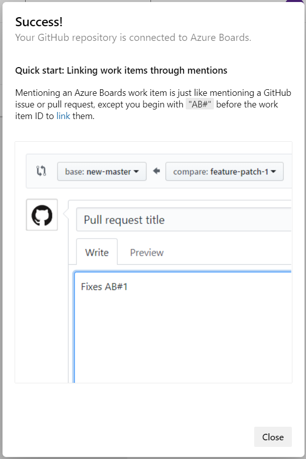

# Continuous Delivery in Azure DevOps hands-on lab step-by-step

## Contents

<!-- TOC -->

- [Before the hands-on lab setup guide](#before-the-hands-on-lab-setup-guide)
  - [Task 1: Create the Project Repo in GitHub](#task-1-create-the-project-repo-in-github)
  - [Task 2: Create GitHub Personal Access Token](#task-2-create-github-personal-access-token)
  - [Task 3: Create Azure DevOps Personal Access Token](#task-3-create-azure-devops-personal-access-token)
  - [Task 4: Create Azure DevOps Project](#task-4-create-azure-devops-project)
  - [Task 5: Connect Azure Board with GitHub](#task-5-connect-azure-board-with-github)

<!-- /TOC -->

# Before the hands-on lab setup guide

You should follow all steps in this document *before* performing the Hands-on lab. Pay close attention to product versions, as the version numbers called out in the lab have been tested and shown successful for the lab.

## Setup environments

Duration: 60 minutes

You should follow all of the steps provided in this section _before_ taking part in the hands-on lab ahead of time.

### Task 1: Create the Project Repo in GitHub

In this task, you will create an account in [GitHub](https://github.com) and use `git` to add lab files to a new repository.

1. Create a new repository in GitHub for the lab files.

    - Browse to [GitHub](https://github.com) in your browser and log into your account.

    - Create a new repository.

      - Select the `New` button.

        

      - Provide a name and description for your new repository.

        > **Note**: The suggested name for the repository is `mcw-continuous-delivery-lab-files`.

      - Select `Private` to make this a private repository.

        

      - Select the `Create Repository` button to create the new repository. Once the repository is created, you should see the quick setup notes.

        

        > **Note:** Copy the URL for this repository, as you need it for the next step.

2. Clone the lab repository.

- Create an appropriate workspace folder and navigate to it in a PowerShell terminal.

 > **Note**: Suggested name for the workspace folder is `C:\Workspaces\lab`, for example:

 ```pwsh
 cd \
 mkdir C:\Workspaces\lab
 cd .\Workspaces\lab
 ```

- You should now be in `C:\Workspaces\lab`. Type the following command and press `<ENTER>`:

 ```pwsh
 git clone https://github.com/rudiansen/MCW-Continuous-delivery-in-Azure-DevOps.git
 ```

- Within the `lab` folder, create a folder for the GitHub repository created in Step 1 and navigate to it in PowerShell.

 ```pwsh
 mkdir mcw-continuous-delivery-lab-files
 cd mcw-continuous-delivery-lab-files
 ```

- You should now be in `C:\Workspaces\lab\mcw-continuous-delivery-lab-files`. The lab files cloned from the Microsoft MCW lab repository should be in `C:\workspaces\lab\MCW-Continuous-delivery-in-Azure-DevOps`. Copy the lab files from the Microsoft MCW lab repository to the new folder.

 ```pwsh
 Copy-Item '..\MCW-Continuous-delivery-in-Azure-DevOps\Hands-on lab\lab-files\*' -Destination ./ -Recurse
 ```

- Initialize the `mcw-continuous-delivery-lab-files` folder as a git repository, commit, and submit contents to remote GitHub branch `main` in the lab files repository created in Step 1.

 > **Note**: The URI of the lab files GitHub repository created in Step 1 will differ from that in the example below.

 ```pwsh
 git init
 git add .
 git commit -m "Initial commit"
 git branch -M main
 git remote add origin https://github.com/YOUR_GITHUB_ACCOUNT/mcw-continuous-delivery-lab-files.git
 git push -u origin main
 ```

### Task 2: Create GitHub Personal Access Token

In this task, you will create a GitHub Personal Access Token (PAT) to be used for working with Docker images in GitHub automation.

1. Log in to your GitHub account.

2. Create a Personal Access Token as [described here](https://docs.github.com/en/authentication/keeping-your-account-and-data-secure/creating-a-personal-access-token). Ensure the following scopes are checked when configuring your GitHub Personal Access Token:

    - `repo` - Full control of private repositories.
    - `workflow` - Update GitHub Action workflows.
    - `write:packages` - Upload packages to GitHub Package Registry.
    - `delete:packages` - Delete packages from GitHub Package Registry.
    - `read:org` - Read org and team membership, read org projects. This is under the `admin:org` section of scopes.

    

3. Copy the GitHub Personal Access Token somewhere safe and accessible for later use during the lab. **DO NOT COMMIT THIS VALUE TO YOUR REPO!**

    

### Task 3: Create Azure DevOps Personal Access Token

In this task, you will create an Azure DevOps Personal Access Token to be used in automating Azure DevOps processes.

1. Log in to your existing Azure DevOps organization or create a new account on <https://dev.azure.com/>.

    

2. Create an Azure DevOps Personal Access Token as [described here](https://docs.microsoft.com/en-us/azure/devops/organizations/accounts/use-personal-access-tokens-to-authenticate?view=azure-devops&tabs=preview-page). For this lab, please ensure your Azure DevOps Personal Access Token is configured with a `Full access` scope.

    > **Note**: A `Full access` scope is not recommended for Azure DevOps Personal Access Tokens in live development and production environments. We are only using this scope for this lab.

    

3. Copy the Azure DevOps Personal Access Token somewhere safe and accessible to you for later use during the lab. **DO NOT COMMIT THIS VALUE TO YOUR REPO!**

    

### Task 4: Create Azure DevOps Project

In this task, you will set up a project in Azure DevOps to be used with the section on continuous deployment in Azure DevOps.

Create a `Fabrikam` project in Azure DevOps for use in the lab with the following settings:

   - **Project name**: `Fabrikam`
   - **Visibility**: `Private`

   

   - Under the **Advanced** settings, be sure to select the following values:
     - **Version control**: `Git`
     - **Work item process**: `Basic`

   - Select the **Create project** button.

### Task 5: Connect Azure Board with GitHub

We can automate our project tracking with the Azure Board integration for GitHub. In this task, you will connect your Azure DevOps project's board to your GitHub repository.

1. On the GitHub Marketplace, find the [Azure Boards Integration App](https://github.com/marketplace/azure-boards).

    

2. Scroll to the bottom of the page and select `Install it for Free`.

3. On the next page, select `Complete order and begin installation`.

4. Select the lab files repository created in [Task 1 of the Before the HOL Instructions](#task-1-create-the-project-repo) and select `Install & Authorize`.

    

    > **Note:** Enter your GitHub password if you are prompted to do so.

5. Select the Azure DevOps organization you signed into or created in the Before Hands-On Lab setup guide and select the Fabrikam project.

    

6. When the integration succeeds, you will be taken to the Azure DevOps Board. Follow the directions in the onboarding tutorial to link an Issue with GitHub commit or pull request.

    

**[⬅️ back to home](../README.md#contents)**  **[⬆️ back to top](#contents)**